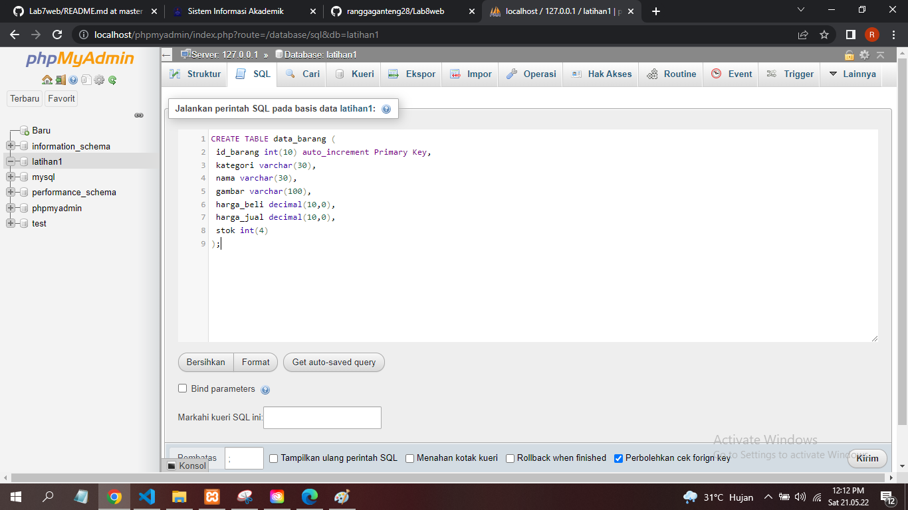
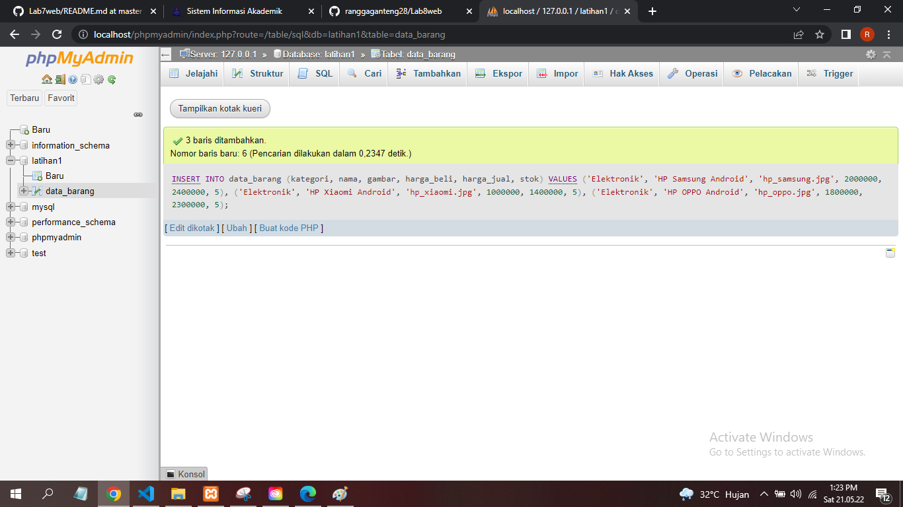
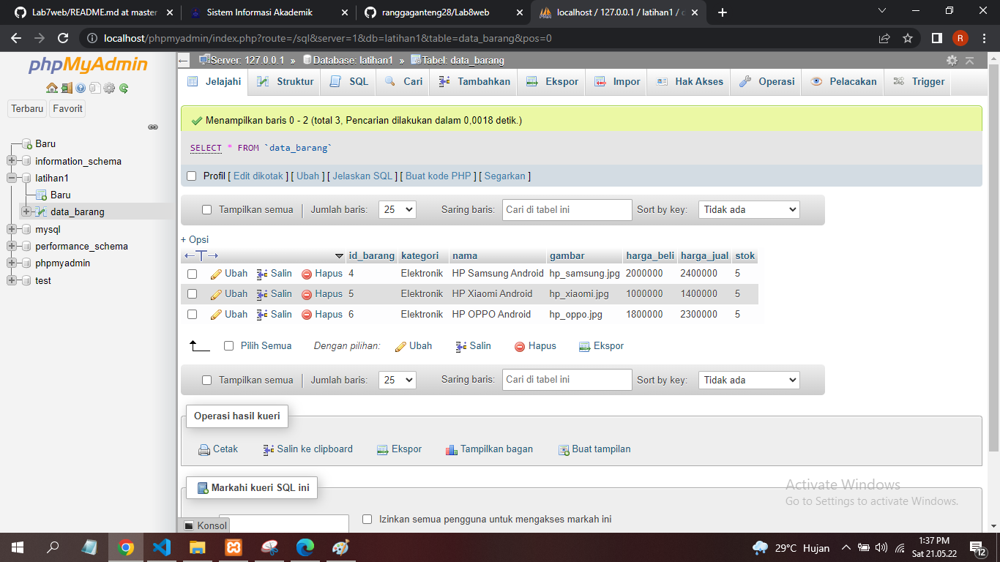
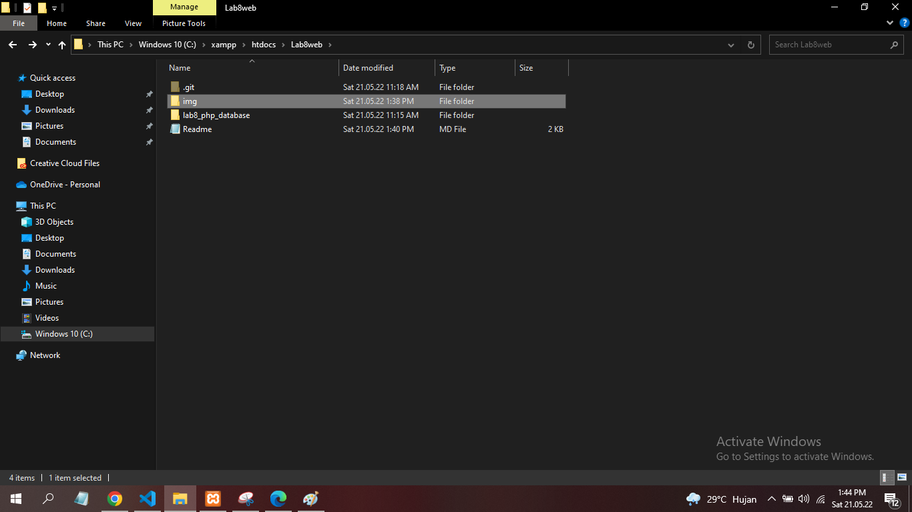
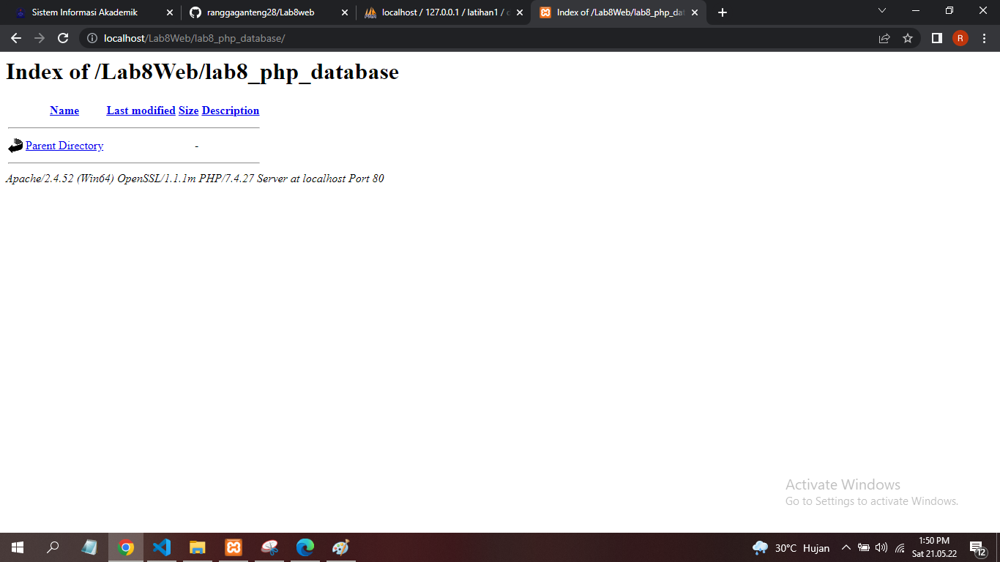

# Praktikum 8

## Profil
| | Biodata |
| -------- | --- |
| **Nama** | Rangga Saputra |
| **NIM** | 312010266 |
| **Kelas** | TI.20.A2 |
| **Mata Kuliah** | Pemrograman Web |

## Langkah 1 

### Menjalankan MySQL Server
Pastikan web server Apache dan MySQL server sudah dijalankan. Kemudian buka melalui browser:`http://localhost/phpmyadmin/`

### Langkah2
Membuat database `latihan1` dan buat tabel
```mySQL
CREATE DATABASE latihan1;
```

**Membuat Tabel**
```mysql
CREATE TABLE data_barang (
id_barang int(10) auto_increment Primary Key,
kategori varchar(30),
nama varchar(30),
gambar varchar(100),
harga_beli decimal(10,0),
harga_jual decimal(10,0),
stok int(4)
);
```

### Menambahkan data


Menambahkan Data pada **DATABASE**
```mysql
INSERT INTO data_barang (kategori, nama, gambar, harga_beli, harga_jual, stok)
VALUES ('Elektronik', 'HP Samsung Android', 'hp_samsung.jpg', 2000000, 2400000, 5),
('Elektronik', 'HP Xiaomi Android', 'hp_xiaomi.jpg', 1000000, 1400000, 5),
('Elektronik', 'HP OPPO Android', 'hp_oppo.jpg', 1800000, 2300000, 5);
```

Data berhasil ditambahkan


```mysql
select * from data_barang;
```

## 4). MEMBUAT PROGRAM CRUD
Buat folder **lab8_php_database** pada root directory web server


Kemudian akses diectory tersebut dengan mengakses URL: http://localhost/Lab8Web/lab8_php_database/



## 5). MEMBUAT FILE KONEKSI DATABASE
Buat file baru dengan nama **koneksi.php**


Database berhasil Terkoneksi

**code php**
```php
<?php
$host = "localhost";
$user = "root";
$pass = "";
$db = "latihan1";
$conn = mysqli_connect($host, $user, $pass, $db);
if ($conn == false)
{
    echo "Koneksi ke server gagal.";
    die();
} else echo "Koneksi berhasil";
?>
```

## 6). MEMBUAT FILE INDEX UNTUK MENAMPILKAN DATA (***READ***)
Buat file baru dengan nama **index.php**


**PENJELASAN**

Tampilan dan hasil pada menu **index.php** atau program menampilkan data.


